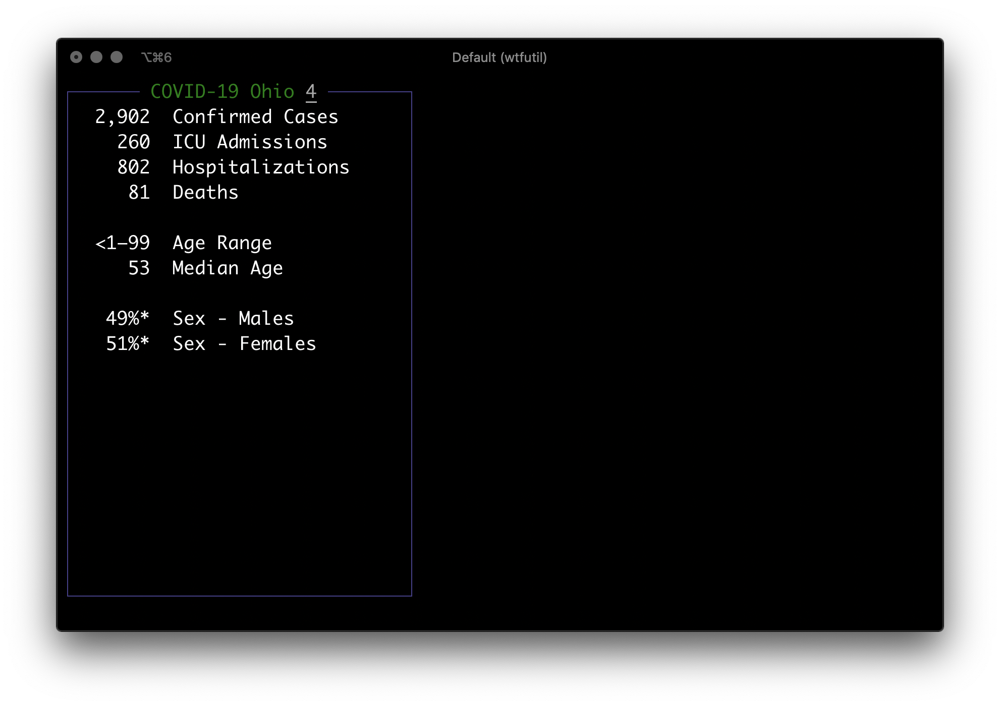

# WTF COVID-19 Ohio

A [WTF](https://wtfutil.com/) (`wtfutil`) dashboard module for [COVID-19 pandemic][1] data from the Ohio Department of Health.


[](https://codeclimate.com/github/wtf-coronavirus-ohio/maintainability)
[](https://codeclimate.com/github/wtf-coronavirus-ohio/test_coverage)
[](https://pypi.org/project/boa-str/)
[](https://pypi.org/project/boa-str/)

Docker Image: [tedmiston/wtf-covid-19-ohio](https://hub.docker.com/r/tedmiston/wtf-covid-19-ohio)

Data: [coronavirus.ohio.gov](https://coronavirus.ohio.gov/)



## Setup

Requires [WTF](https://github.com/wtfutil/wtf) and [Docker](https://www.docker.com/).

If SQLite is available, it will be used as a cache.

## Install

Add the `covid-19-ohio` module config to `wtf.mods` in your WTF config file:

```yaml
wtf:
  ...
  mods:
    ...
    covid-19-ohio:
      type: cmdrunner
      title: COVID-19 Ohio
      cmd: docker
      args: ["run", "--rm", "tedmiston/wtf-covid-19-ohio:v1.2.2"]
      position:
        top: 4
        left: 0
        height: 2
        width: 1
      refreshInterval: 3600  # 3600 seconds == 1 hour
      enabled: true
```

The config file is located at `~/.config/wtf/config.yml` by default.

The module runs a Docker container so it should *just work*.

## Quickstart

Just run the WTF dashboard:

```shell
$ wtfutil
```

[1]: https://en.wikipedia.org/wiki/COVID-19_pandemic
